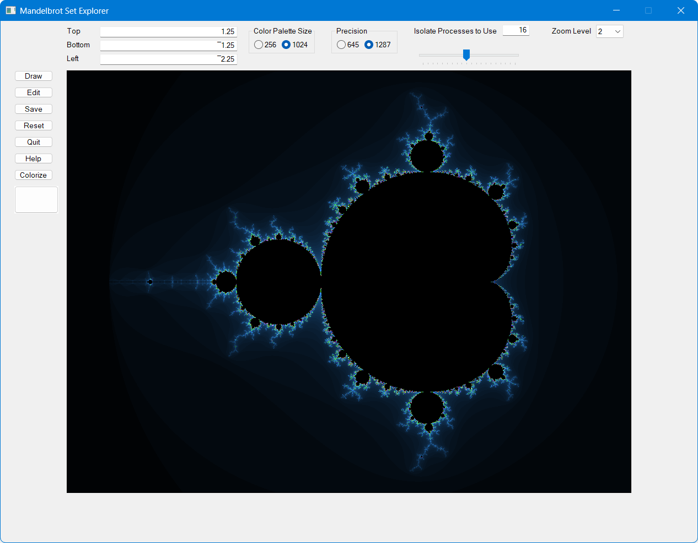

# Mandelbrot Set Explorer

This is a project that began in 2006 when I wanted to learn the Dyalog APL's GUI framework. For more information on its evolution see [history](history.md)

## Quick Start
* Do one or more of the following:
   * Clone the https://github.com/bpbecker/mandelbrot repository
   * Download and unzip the latest release
   * Download and unzip mandelbrot.zip from the assets of the latest release
 * Start Dyalog APL for Windows, preferably a 64-bit Unicode version
 * Import the explorer, depending on which option you chose above, the explorer code will be in the `/source` folder of the repository, or in the folder you unzipped mandelbrot.zip into
   * `]import # {folder}` 
 * Start the explorer by entering `run`

## Exploring the Mandelbrot set
The explorer has a fixed 4:3 aspect ratio. You can zoom in and explore the set in any of three ways:

* Click and hold your left mouse button and drag the mouse. This will draw a rectangle of the area to zoom in on. Release the mouse button and the new image will be drawn.
* Right-click to zoom with the center of the new image is where the mouse icon points. The zoom level is controlled by the Zoom Level field in the upper-right corner of the screen.
* Enter Top, Bottom, and Left values in their respective fields and then click the Draw button.